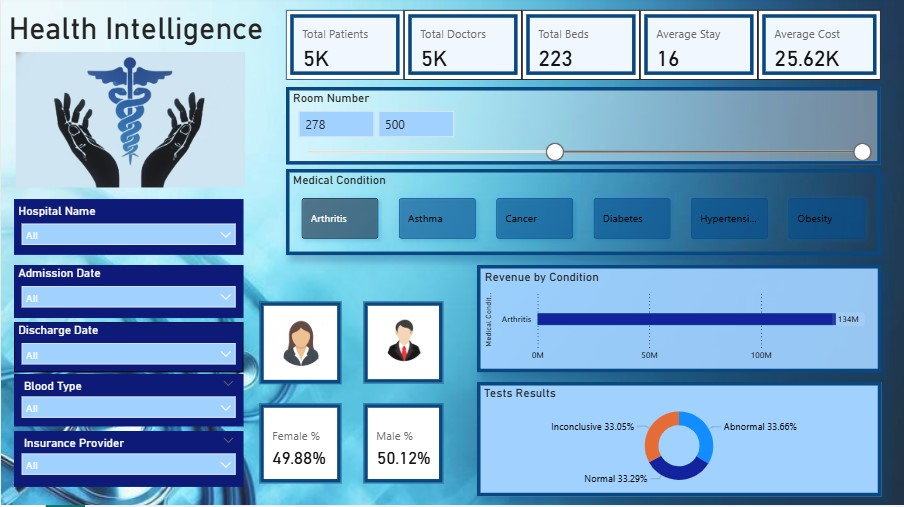

# 🏥 Healthcare Intelligence Dashboard

## 🌟 Project Overview

This project focuses on a comprehensive **Data Analysis** of a healthcare dataset to derive meaningful insights into patient demographics, medical conditions, billing practices, and hospital operations. The process included rigorous data cleaning and preparation, culminating in the creation of an interactive **Power BI Dashboard** for effective visualization and reporting.

## 🎯 Objective

The primary objective of this project was to:
* Identify relationships between **patient demographics** (Age, Gender, Blood Type) and **Medical Conditions**.
* Analyze the distribution of **Billing Amounts** across different **Insurance Providers** and **Admission Types**.
* Visualize trends in **Patient Admissions and Discharges** over time.
* Provide actionable insights to improve operational efficiency and patient care quality.

## 📊 Dataset Description

The analysis is based on the **Healthcare Patient Records Dataset**.
* **Source:** Kaggle
* **Initial File:** `healthcare_dataset.csv`
* **Key Data Points:** Name, Age, Gender, Medical Condition, Insurance Provider, Billing Amount, Admission Type, and Test Results.

## 🛠️ Tools Used

* **Data Processing/Cleaning:** Microsoft Excel
* **Data Visualization/Dashboard:** Microsoft Power BI
* **Documentation & Version Control:** GitHub

## ⚙️ Data Cleaning and Preparation Highlights

The initial dataset contained various inconsistencies that required cleaning to ensure analytical accuracy. Key steps included:
- Standardized date formats  
- Fixed inconsistent name capitalization  
- Cleaned gender entries (Male/Female)  
- Removed duplicate records  
- Normalized medical conditions  
- Cleaned billing amounts into numeric format  
- Validated room numbers, ages, and test result categories  

## 📈 Power BI Dashboard & Analysis

The interactive dashboard, created using **Power BI**, visualizes key performance indicators (KPIs) and trends.

### **Dashboard Key Features:**

* **KPI Cards:** Total Patients, Average Billing Amount, and Average Length of Stay.
* **Distribution Analysis:** Breakdown of patients by **Medical Condition** and **Gender**.
* **Financial Insight:** Comparison of Billing Amounts across different **Insurance Providers** (e.g., Aetna, Cigna, Medicare, etc.).
* **Trend Visualization:** Monthly or yearly trend of patient admissions.

### **Key Insights Derived:**

1.  The most common medical condition among patients is 'High Blood Pressure', closely followed by 'Obesity'.
2.  Patients with the 'Emergency' admission type show a significantly higher average Billing Amount compared to 'Elective' admissions.
3.  'Medicare' and 'Aetna' are the top two insurance providers based on patient volume and total billing.

### **Dashboard Final View**

## 💡 Conclusion

This project successfully transformed raw healthcare data into a valuable, interactive visualization tool. The analysis highlights critical areas such as the prevalence of specific medical conditions, financial distribution across insurance providers, and operational load related to admission types. These insights can be used by hospital administrators to:

* **Resource Allocation:** Better allocate resources to manage high-prevalence diseases.
* **Financial Planning:** Understand revenue streams and negotiation power with major insurance providers.
* **Process Improvement:** Streamline processes for high-volume admission types like 'Emergency'.

The dashboard serves as a single source of truth for monitoring key performance metrics in patient care and hospital management.

## 📂 Repository File Structure

This repository contains the following files to document the entire project:

| File Name/Type | Description |
| :--- | :--- |
| `healthcare_dataset.csv` | The raw, initial HealthCare dataset collected. |
| `Project_healthcare_anudip.pbix` | The source file for the Power BI dashboard, including data models and reports. |
| `Health Intelligence Dashboard Screenshot.jpg` | The Screenshot of the Health Intelligence Dashboard. |
| `README.md` | This file, providing a complete project summary, insights, and documentation. |

### 7. Conclusion
The Health Intelligence dashboard provides hospital administrators with real-time, actionable insights, enabling better decision-making, cost analysis, and patient-care optimization.
